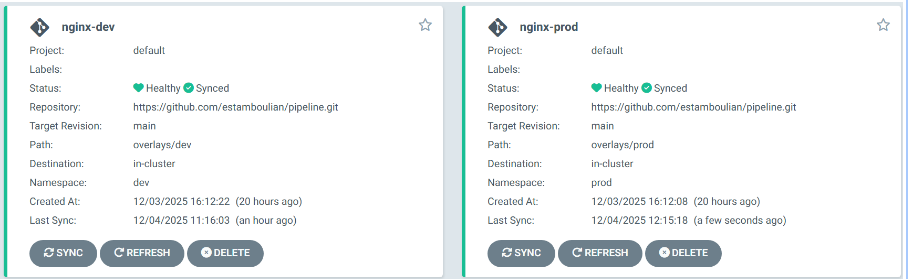
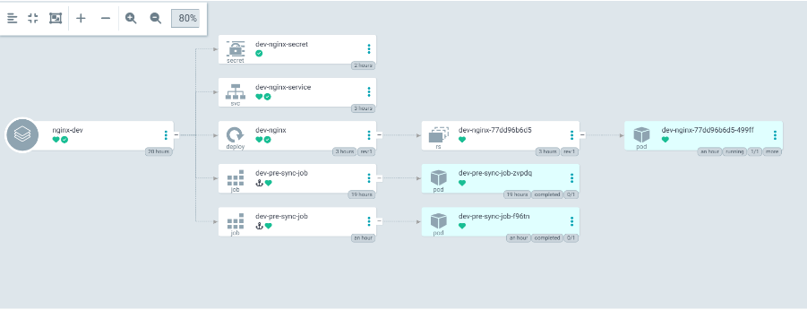
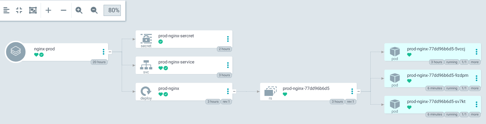
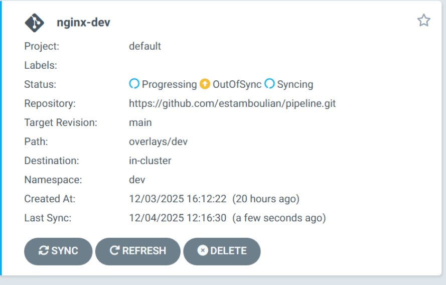

# Projet déploiement CI/CD dans Kubernetes


## 1. Architecture du Projet (Kustomize)

Le dépôt est structuré selon le modèle standard **Base / Overlays** pour éviter la duplication de code.

```md
├── .github/workflows/
│   └── security.yml       # Pipeline CI (Trivy : Scan Secrets & Images)
├── base/                  # Configuration de base (Commune)
│   ├── deployment.yaml    # Déploiement de l'application Nginx
│   ├── service.yaml       # Service pour exposer l'app
│   └── kustomization.yaml # Point d'entrée Kustomize Base
├── overlays/              # Environnements spécifiques
│   ├── dev/
│   │   ├── kustomization.yaml
│   │   ├── nginx-dev.yaml   # Patch : Configuration légère pour le dév
│   │   ├── secret-dev.yaml  # Secrets pour le dév (Test détection Trivy)
│   │   └── presync.yaml     # Hook ArgoCD : Job exécuté avant la synchro
│   └── prod/
│       ├── kustomization.yaml
│       ├── nginx-prod.yaml  # Patch : Haute dispo pour la prod
│       └── secret-prod.yaml # Secrets pour la prod
└── README.md
```
## 2. Le Déploiement Continu (CD) avec ArgoCD

Création de deux applications qui respect le CRD d'ArgoCD pour un déploiement de Dev et de Prod,
```sh
root@control-plane:~/devsecops/pipeline/overlays/prod# kubectl get application -n argocd
NAME         SYNC STATUS   HEALTH STATUS
nginx-dev    Synced        Healthy
nginx-prod   Synced        Healthy
```


Pour le déploiement de notre application Nginx, nous utilisons un fichier de customisation (kustomization.yaml) pour isoler l'environnement de développement. Cela rend possible l'application de paramètres dédiés, tels que PreSync et la gestion de secrets spécifiques à la dev.



Pour la production, l'isolation est assurée par un fichier de customisation dédié. Celui-ci déploie l'application sur 3 réplicas pour assurer la résilience et intègre des secrets spécifiques, distincts de ceux du développement.



Pour tester la robustesse du déploiement, nous avons altéré le cluster manuellement. ArgoCD, qui surveille l'état en permanence, a identifié que le nombre de réplicas ne correspondait plus au manifeste Git. Il a donc automatiquement écrasé nos modifications manuelles pour revenir à l'état stable.



## 3. Pipeline github

Concrètement, le pipeline agit comme un filet de sécurité automatique. À chaque fois qu'on modifie le code, GitHub Actions lance l'outil Trivy pour faire un check-up complet. Il vérifie trois choses essentielles : qu'on n'a pas laissé traîner de mot de passe par erreur (secrets), que nos fichiers de configuration respectent les règles, et surtout que les images Docker utilisées ne contiennent pas de failles critiques. Si le moindre problème grave est détecté, le pipeline bloque tout net : cela nous oblige à corriger la faille avant même de pouvoir penser à déployer.

## 4. Flagger

Un Canary a été créé pour le déploiement dev-nginx via le fichier specnginx.yaml. Ce fichier définit le Deployment cible, le service exposé, l’Ingress à surveiller, ainsi que les paramètres du déploiement progressif, tels que l’intervalle de contrôle, le seuil, le pas de montée en charge et les métriques à suivre. Une fois appliqué, Flagger surveille le Deployment et son statut est initialisé (Initialized). Tant qu’aucune modification n’est apportée au Deployment (nouvelle image ou changement de configuration), le déploiement progressif ne démarre pas. Lorsqu’une mise à jour est effectuée, Flagger crée automatiquement un pod canary, redirige progressivement le trafic en fonction du stepWeight, contrôle les métriques de succès et de latence, puis promeut la nouvelle version si tout est conforme, ou effectue un rollback en cas de problème.

### Installation de flagger
kubectl apply -k https://github.com/fluxcd/flagger/kustomize/kubernetes?ref=main

### Affichage des pods
```sh
root@control-plane:~/devsecops/pipeline# kubectl get pods -n flagger-system
NAME                                  READY   STATUS    RESTARTS   AGE
flagger-58f9c55859-9xplr              1/1     Running   0          106m
flagger-prometheus-546f68b775-trckl   1/1     Running   0          106m
```

```sh
root@control-plane:~/devsecops/pipeline# kubectl get canary -n dev
NAME        STATUS        WEIGHT   LASTTRANSITIONTIME
nginx-dev   Initialized   0        2025-12-04T10:15:59Z
```

